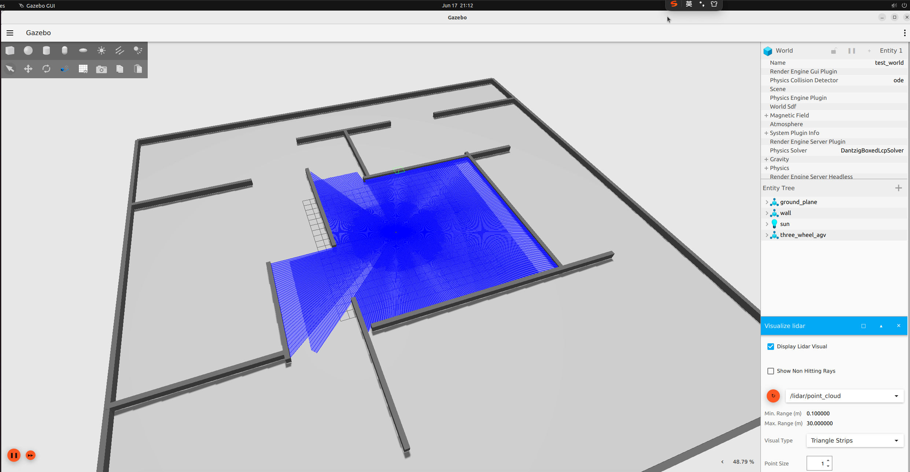

## 三舵轮机器人实现

colcon build --packages-select simulated_chassis --symlink-install
source install/setup.bash
ros2 launch simulated_chassis three_wheel_sim.launch.py

## 前进
ros2 topic pub /three_wheel_base_controller/cmd_vel geometry_msgs/msg/Twist '{linear: {x: -0.2, y: 0.0}, angular: {z: 0.0}}' --rate 2

## 原地旋转
ros2 topic pub /three_wheel_base_controller/cmd_vel geometry_msgs/msg/Twist '{linear: {x: 0.0, y: 0.0}, angular: {z: 0.5}}' --rate 2

## 平移
ros2 topic pub /three_wheel_base_controller/cmd_vel geometry_msgs/msg/Twist '{linear: {x: 0.0, y: -0.5}, angular: {z: 0.0}}' --rate 2

## 停止
ros2 topic pub /three_wheel_base_controller/cmd_vel geometry_msgs/msg/Twist '{linear: {x: 0.0, y: 0.0}, angular: {z: 0.0}}' --rate 1

## 效果图

## gazebo 
ign topic -e -t /clock
