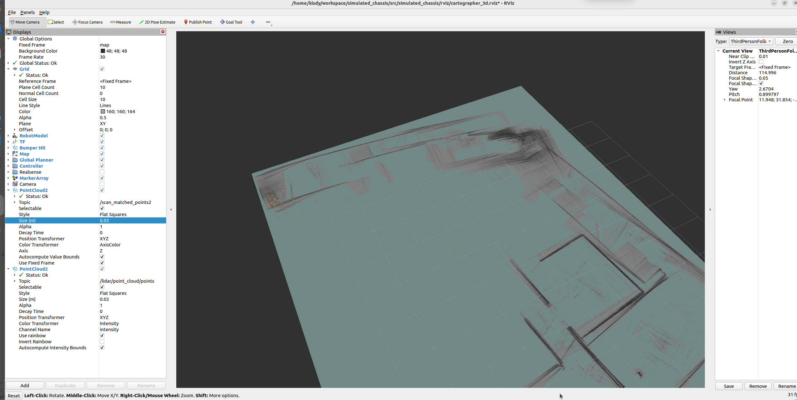
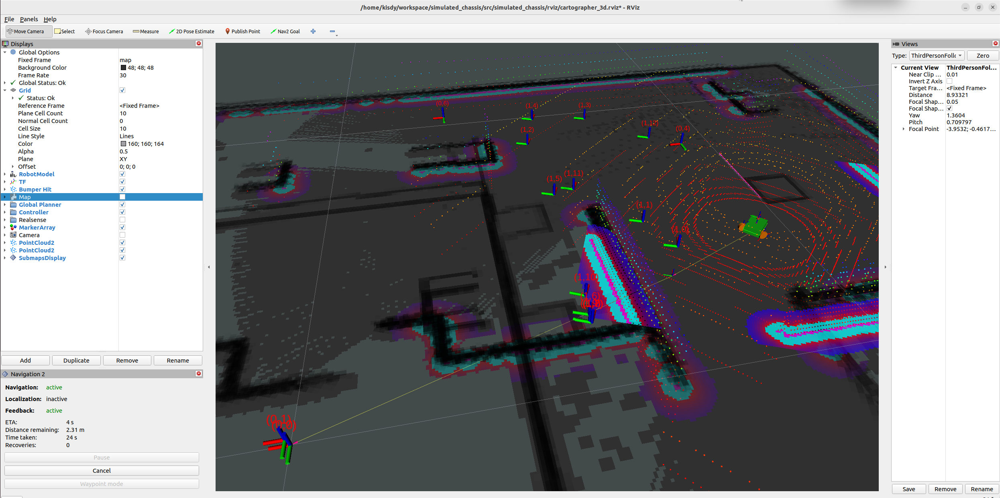

## 三舵轮机器人实现（3D雷达）

colcon build --packages-select simulated_chassis --symlink-install
source install/setup.bash
ros2 launch simulated_chassis three_wheel_sim.launch.py

## 在线建图
source install/setup.bash
ros2 launch simulated_chassis slam3d_online.launch.py

# 保存为 .pbstream（Cartographer 原生格式）
ros2 service call /write_state cartographer_ros_msgs/srv/WriteState "{filename: 'my_map.pbstream'}"

# 转换为 .pgm + .yaml
ros2 run cartographer_ros cartographer_pbstream_to_ros_map \
    -pbstream_filename my_map.pbstream \
    -map_filestem my_map

# 先录制 bag 包（在线建图时录制）
ros2 bag record -o my_bag /lidar/point_cloud/points /odom /imu /tf /tf_static /clock

# 正确录制方式（只录原始数据）
ros2 bag record -o my_bag \
    /lidar/point_cloud/points \
    /odom \
    /imu \
    /clock \
    /tf_static   # 只录静态 TF，不录动态 TF

# 离线建图
ros2 launch simulated_chassis slam3d_offline.launch.py \
    bag_filenames:=my_bag \
    save_state_filename:=my_map_optimized.pbstream

# 离线建图
cd ~/workspace/simulated_chassis

ros2 launch simulated_chassis slam3d_offline.launch.py \
    bag_filenames:="/home/kisdy/workspace/simulated_chassis/my_bag" \
    save_state_filename:="/home/kisdy/workspace/simulated_chassis/my_map_optimized.pbstream"

# 启动导航
ros2 launch simulated_chassis navigation.launch.py \
    pbstream_file:=/home/kisdy/workspace/simulated_chassis/my_map_optimized.pbstream \
    use_sim_time:=true

## 前进
ros2 topic pub /three_wheel_base_controller/cmd_vel geometry_msgs/msg/Twist '{linear: {x: -0.2, y: 0.0}, angular: {z: 0.0}}' --rate 2

## 原地旋转
ros2 topic pub /three_wheel_base_controller/cmd_vel geometry_msgs/msg/Twist '{linear: {x: 0.0, y: 0.0}, angular: {z: 0.5}}' --rate 2

## 平移
ros2 topic pub /three_wheel_base_controller/cmd_vel geometry_msgs/msg/Twist '{linear: {x: 0.0, y: -0.5}, angular: {z: 0.0}}' --rate 2

## 停止
ros2 topic pub /three_wheel_base_controller/cmd_vel geometry_msgs/msg/Twist '{linear: {x: 0.0, y: 0.0}, angular: {z: 0.0}}' --rate 1

## 效果图

## 建图rviz 预览效果

## 导航rviz效果图

## gazebo 
ign topic -e -t /clock

# 控制器状态查看

## slam 建图遇到几个坑
1，tf完整，但是rviz没有地图，仿真时候，需要指定imu和雷达的frame_id <ignition_frame_id>lidar_link</ignition_frame_id> ,<ignition_frame_id>imu_link</ignition_frame_id>
2，步骤1做了，但是还是没地图，建图时候，gazebo修改世界，将机器人模型保存到了世界中，导致slam建图，提示雷达坐标系不存在，urdf目录加载的机器人被世界的机器人覆盖了，frame id异常了
