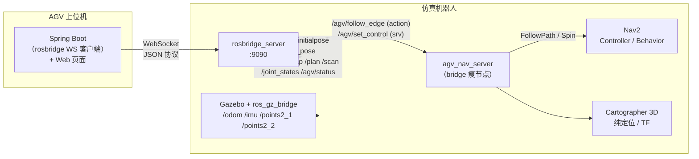

# 上位机对接指南（rosbridge WebSocket · Spring Boot）

> 本文档描述真实 AGV 上位机（Spring Boot / 调度系统 / Web 页面）如何通过
> `rosbridge_server` 的 **JSON over WebSocket** 协议对接本仿真机器人，
> 取代原先的私有 WebSocket 协议 + HTTP 上报。
>
> 面向目标：在 Web 页面上**显示机器人位置、雷达、地图，并能下发导航目标点**。
> 全程只收发 JSON，上位机不需要任何 ROS 依赖。

---

## 0. 开始前必读：先修白名单配置（否则什么都收不到）

`launch/agv_rosbridge.launch.py` 中 `topics_pub_glob` / `topics_sub_glob` 的填法**当前是反的**。
rosbridge 的真实语义（以 humble 分支源码为准，`advertise.py` / `subscribe.py`）：

| rosbridge 参数 | 真实含义 | 本项目应该填 |
|---|---|---|
| `topics_sub_glob` | 上位机**能订阅**（收数据）的 topic | `/odom /tf /tf_static /map /plan /local_plan /joint_states /agv/status`（加雷达后补 `/scan`） |
| `topics_pub_glob` | 上位机**能发布**（下数据）的 topic | `/cmd_vel /initialpose /goal_pose` |

如果保持现状（pub=上报列表、sub=下发列表），后果是：

- 上位机 subscribe `/agv/status`、`/map`、`/tf` → rosbridge **静默拒绝订阅**（只在服务端日志打 warn，客户端无任何报错）
- 上位机 publish `/cmd_vel`、`/goal_pose` → 被拒绝
- 而 action / service 不受这两个参数限制，会出现「能下发移动、收不到任何数据」的迷惑现象

**修法：把 launch 里两个列表互换**，同时建议补充 `actions_glob: ['/agv/*']`
（否则上位机可以直接调 nav2 原生 action 绕过业务层）。

确认安装的 rosbridge 版本支持 pub/sub 分离白名单（老版本只认 `topics_glob`，这两个参数会被静默忽略）：

```bash
ros2 param get /rosbridge_websocket topics_sub_glob   # 能取到列表即支持
```

---

## 1. 架构总览



关键变化：上位机不再是「调用私有 HTTP 接口」，而是**直接成为 ROS 2 图的一个客户端**。
它收到的 `x/y/theta` 就是 `/tf` 里的真实位姿，发的移动指令就是 `/agv/follow_edge` 这个标准 action。

---

## 2. rosbridge 协议速成（只用这 8 个 op）

一条 rosbridge 消息就是一个带 `op` 字段的 JSON 对象。

### 2.1 上报方向（上位机收）

**订阅话题**

```json
{"op":"subscribe","id":"sub_status","topic":"/agv/status",
 "type":"agv_bridge_v2_interfaces/msg/AgvStatus","throttle_rate":1000,"queue_length":1}
```

- `throttle_rate`：最小发送间隔（毫秒），0 = 不限流
- `type` 可省略（rosbridge 自动从 ROS 图推断），但显式写上更稳
- 之后 rosbridge 持续推 `{"op":"publish","topic":"/agv/status","msg":{...}}`

**动作反馈 / 结果**：对 `send_action_goal` 的回应，见 2.2 与 5.1。

### 2.2 下发方向（上位机发）

**发布话题**（先 advertise 声明类型，再 publish）

```json
{"op":"advertise","id":"pub_goal","topic":"/goal_pose","type":"geometry_msgs/msg/PoseStamped"}
{"op":"publish","topic":"/goal_pose","msg":{ ... }}
```

**调用服务**

```json
{"op":"call_service","id":"c1","service":"/agv/set_control","args":{"action":"stop"},"timeout":5.0}
```
回应：`{"op":"service_response","id":"c1","service":"/agv/set_control","result":true,"values":{...}}`

**下发动作目标 / 取消**

```json
{"op":"send_action_goal","id":"move_42","action":"/agv/follow_edge",
 "action_type":"agv_bridge_v2_interfaces/action/FollowEdge","feedback":true,"args":{ ...goal 字段... }}
{"op":"cancel_action_goal","id":"move_42","action":"/agv/follow_edge"}
```

- `id` 自己起，**后续所有 feedback / result / cancel 都靠这个 id 关联**，取消时必须与发送时完全一致
- 收到的结果消息：

```json
{"op":"action_result","id":"move_42","status":4,"result":true,
 "values":{"success":true,"message":"导航到点成功！","command_id":"move_0ca1","node_id":"I006"}}
```

`status` 为 `action_msgs/msg/GoalStatus` 枚举：`1=ACCEPTED 2=EXECUTING 3=CANCELING 4=SUCCEEDED 5=CANCELED 6=ABORTED`。

### 2.3 分片与压缩

大消息（如 `/map`）会被拆成分片：

```json
{"op":"fragment","id":"f1","data":"{\"op\":\"publish\"...","num":0,"total":3}
```

按 `id` 分组、按 `num` 顺序拼接 `data` 字符串，再整体 `JSON.parse`。
**自研客户端必须实现分片重组**；订阅大话题时附带 `"fragment_size": 500000`。

`subscribe` 还支持 `"compression":"png" | "cbor"`（服务端→客户端）：
`/map` 用 png 体积小一个量级，但客户端要自己解 PNG 重建消息；手写 Java 客户端建议先用明文 JSON 跑通。

> 服务端已配置：心跳 5s ping / 15s 超时、断线后订阅保留 10s（容忍闪断重连）、
> 单条消息上限 10MB、permessage-deflate 压缩。

---

## 3. bridge 节点提供的桥接能力

### 3.1 业务接口总表

`agv_nav_server` 是 rosbridge 架构下的「瘦节点」，对外只有 3 个业务接口 + 1 条 TF：

| 接口 | 类型 | 方向 | 说明 |
|---|---|---|---|
| `/agv/follow_edge` | action（`agv_bridge_v2_interfaces/action/FollowEdge`） | 下发 | **移动控制唯一入口**：直线 / 贝塞尔曲线 / 倒车，带指令 ID 对账、400ms 位姿反馈、可取消 |
| `/agv/set_control` | service（`agv_bridge_v2_interfaces/srv/SetControl`） | 下发 | `start`（恢复接单）/ `stop`（停车+暂停接单）/ `reset`（复位） |
| `/agv/status` | topic（`agv_bridge_v2_interfaces/msg/AgvStatus`，1Hz） | 上报 | 业务状态（含「定位是否收敛」门控） |
| TF `map → AGV001/base_link` | tf（10Hz） | 上报 | 机器人全局位姿（走 `/tf` 话题透出） |

### 3.2 原生话题透传（白名单内）

bridge 未加工、rosbridge 直接透传的标准话题：

- 上报（subscribe）：`/odom`、`/tf`、`/tf_static`、`/map`、`/plan`、`/local_plan`、`/joint_states`
- 下发（publish）：`/cmd_vel`（由 cmd_vel_relay 转发到底盘控制器）、`/initialpose`、`/goal_pose`

### 3.3 旧私有协议 → rosbridge 命令映射（迁移参考）

| 旧私有协议 | 新 rosbridge op | 目标接口 |
|---|---|---|
| WS `{"type":"register"}` | 无需 | WS 连接建立即注册，断开即注销 |
| WS `{"type":"heartbeat"}` | 无需 | `websocket_ping_interval=5s` |
| WS `{"type":"move_to", ...}` | `send_action_goal` | `/agv/follow_edge` |
| WS `{"type":"stop_move"}` | `cancel_action_goal` | `/agv/follow_edge` |
| WS `{"type":"set_initial_pose"}` | `publish` | `/initialpose` |
| WS `{"type":"velocity_command"}` | `publish` | `/cmd_vel` |
| WS `{"type":"agv_control"}` | `call_service` | `/agv/set_control` |
| WS `{"type":"query_status"}` | `subscribe` | `/agv/status` |
| HTTP `handle_position_update` | `subscribe` | `/odom`、`/tf` |
| HTTP `handle_status` | `subscribe` | `/agv/status` |
| HTTP `handle_command_ack` | `action_result` | `/agv/follow_edge` 的 result |
| HTTP `handle_laser_scan` | `subscribe` | ⚠️ 本仿真栈**没有** `/scan`，见 7.3 |

---

## 4. 上报数据清单（上位机能收什么）

### 4.1 `/agv/status` —— 业务状态（1Hz，必订）

```json
{"op":"publish","topic":"/agv/status","msg":{
  "header":{"stamp":{"sec":1772445676,"nanosec":0},"frame_id":"map"},
  "agv_id":"AGV001",
  "state":"EXECUTING",
  "battery":100.0,
  "pose_initialized":true,
  "active_command_id":"move_0ca1e7b0-9a9f-470e-9a16-10035ac4237c",
  "active_node_id":"I006"
}}
```

`state` 取值：`IDLE / PRE_ROTATING / EXECUTING / BACKING_UP / END_ROTATING / COMPLETED / FAILED / CANCELLED / STOPPED`。
`pose_initialized=false` 时**不要下发导航指令**（节点会直接 abort）。
该话题使用 `transient_local` QoS：rosbridge 的订阅会持续收到 1Hz 数据流，客户端接入后最多等一个周期即可拿到状态。

### 4.2 `/tf` —— 机器人实时位姿（10Hz，推荐的位置来源）

bridge 每 100ms 广播一条 `map → AGV001/base_link` 变换。订阅 `/tf` 后**过滤**出
`header.frame_id == "map"` 且 `child_frame_id == "<agv_id>/base_link"` 的那条即为全局位姿：

```json
{"op":"publish","topic":"/tf","msg":{"transforms":[{
  "header":{"stamp":{"sec":1234,"nanosec":800000000},"frame_id":"map"},
  "child_frame_id":"AGV001/base_link",
  "transform":{"translation":{"x":-8.29,"y":-1.34,"z":0.0},
               "rotation":{"x":0.0,"y":0.0,"z":0.089,"w":0.996}}
}}]}
```

yaw 解算：`theta = 2*atan2(qz, qw)`（平面机器人 roll/pitch≈0 时成立）。

### 4.3 `/odom` —— 里程计（odom 系）

```json
{"op":"publish","topic":"/odom","msg":{
  "header":{"stamp":{"sec":1772445676,"nanosec":314000000},"frame_id":"odom"},
  "child_frame_id":"base_link",
  "pose":{"pose":{"position":{"x":1.23,"y":-4.56,"z":0.0},
                  "orientation":{"x":0.0,"y":0.0,"z":0.089,"w":0.996}}},
  "twist":{"twist":{"linear":{"x":0.42,"y":0.0,"z":0.0},
                    "angular":{"x":0.0,"y":0.0,"z":-0.05}}}
}}
```

含位姿 + 线/角速度，频率高。注意它是 **odom 坐标系**，与地图存在定位漂移偏差；
要在地图上画车，用 4.2 的 map 系 TF 最准。

### 4.4 `/map` —— 栅格地图（Cartographer，约 1Hz）

`nav_msgs/OccupancyGrid`：

```json
{"op":"publish","topic":"/map","msg":{
  "header":{"frame_id":"map"},
  "info":{"resolution":0.05,"width":400,"height":400,
          "origin":{"position":{"x":-10.0,"y":-10.0,"z":0.0},"orientation":{"w":1.0}}},
  "data":[0,0,100,-1,...]
}}
```

- `data` 为 int8 数组，行优先；`-1`=未知，`0`=空闲，`1~100`=占据
- 尺寸估算：400×400=16 万个数字 ≈ 400~600KB JSON。
  **订阅时加 `"throttle_rate":5000,"queue_length":1,"fragment_size":500000`**
- 渲染公式见 7.2

### 4.5 `/plan`、`/local_plan` —— 导航路径

`nav_msgs/Path`：`{"poses":[{header:{frame_id:"map"}, pose:{position, orientation}}, ...]}`。
页面上依次连线，配合 `/map` 展示「机器人要走/在走的路线」。

### 4.6 `/joint_states` —— 底盘关节（可选）

三舵轮转向角，调试用，业务页面可忽略。

### 4.7 `/rosapi/*` —— 图元数据与 DTO 自动生成

```json
{"op":"call_service","id":"t1","service":"/rosapi/topics","args":{}}
{"op":"call_service","id":"m1","service":"/rosapi/message_details",
 "args":{"type":"agv_bridge_v2_interfaces/action/FollowEdge_Goal"}}
```

响应中的 `typedefs` 给出 `fieldnames / fieldtypes / fieldarraylen`，
Spring Boot 侧可据此自动生成与 `.action` 保持同步的 Java DTO，彻底摆脱手工对字段。
其他常用：`/rosapi/topics_and_raw_types`、`/rosapi/topics_for_type`、`/rosapi/services`、
`/rosapi/nodes`、`/rosapi/action_servers`、`/rosapi/get_time`。

### 4.8 刻意不开放 / 拿不到的数据

| 数据 | 原因 |
|---|---|
| `/points2_1`、`/points2_2`（3D 雷达 `PointCloud2`） | 单帧几十万浮点，JSON 编码可达**数 MB**，走 WebSocket 会打爆链路；雷达显示方案见 7.3 |
| `/imu` | Gazebo 输出 >100Hz，已由 Cartographer 融合进定位，无需重复消费 |
| `/clock` | 仿真时钟高频，用消息自带 `header.stamp` 即可 |
| `/scan`、`/amcl_pose` | 本仿真栈**不产生**：底盘是 3D 雷达 + Cartographer 纯定位，非 AMCL；`/scan` 可按 7.3 自行添加 |
| `/speed_limit` | 全局话题，多客户端并发会互相覆盖，由节点内部独占，**绝不加白名单** |
| ROS 参数（除 `/agv_nav_server/*`） | `params_glob` 白名单限制，防止远端改掉 nav2 关键参数 |

---

## 5. 下发数据清单（上位机能发什么）

### 5.1 移动控制 —— `/agv/follow_edge` action（推荐，业务闭环）

一条 goal 同时承载直线 / 曲线 / 倒车。最小可用示例（「从当前位置直线开到 (x,y)，到点对准 theta」）：

```json
{"op":"send_action_goal","id":"move_42","action":"/agv/follow_edge",
 "action_type":"agv_bridge_v2_interfaces/action/FollowEdge","feedback":true,
 "args":{
   "command_id":"move_0ca1",      // 自己生成，结果里原样回传，用于对账
   "node_id":"I006",              // 目标节点 ID（没有可传 ""）
   "x":-8.299,"y":-1.349,"theta":0.1787,   // map 系目标位姿，theta 弧度
   "edge_id":"","edge_type":"STRAIGHT","source_id":"","target_id":"",
   "max_speed":0.6,               // m/s，节点内部通过 /speed_limit 下发
   "back_up":false,"reverse":false,
   "step":0.1,                    // 路径采样步长
   "end_point":true,              // true = 到点后再旋转对准 theta
   "control_points":[]            // 贝塞尔控制点 [{x,y},...]，1~2 个；空 = 直线
 }}
```

Goal 字段速查：

| 字段 | 类型 | 说明 |
|---|---|---|
| `command_id` / `node_id` | string | 原样回传，对账用 |
| `x` `y` `theta` | float64 | map 系目标位姿，theta 为弧度 |
| `edge_type` | string | `STRAIGHT` / `CURVE` / `ELEVATION`（按直线处理）；有 control_points 不写也会按 CURVE |
| `max_speed` | float64 | 倒车建议压到 0.15~0.3（不超过底盘 `vx_min` 绝对值），step 可取 0.05 |
| `back_up` | bool | true=保持朝向直线后退，**绝不自动旋转**；偏差超限直接 FAILED（见 6.3） |
| `reverse` | bool | 沿边反向（控制点顺序自动反转，一般配合 source_id/target_id 用） |
| `end_point` | bool | 最后一段才传 true（到达后做最终旋转），见 10.1 |
| `control_points` | array | 二阶曲线 1 个点、三阶 2 个点；≥3 个会**静默退化成直线** |

执行时序：角度差 >45° 时先原地预旋转（`PRE_ROTATING`）→ 沿直线/曲线行驶（`EXECUTING`）→
（`end_point=true` 时）到点旋转对准 theta（`END_ROTATING`）→ 返回 result。
全程每 400ms 一次 feedback：

```json
{"op":"action_feedback","id":"move_42","action":"/agv/follow_edge",
 "values":{"x":-7.81,"y":-1.02,"theta":0.35,"state":"EXECUTING"}}
```

节点收到 goal 后内部依次调度 nav2 的 `spin` / `follow_path`，取消时也会依次取消它们，
最终以 `CANCELED` 结束该 goal。

**取消移动**：`{"op":"cancel_action_goal","id":"move_42","action":"/agv/follow_edge"}`

### 5.2 自由导航 —— `/goal_pose`（最简）

RViz「2D Goal Pose」发的标准话题，nav2 行为树直接接单，**适合页面上点一下地图就开过去**
（自主规划路径、可绕障，不限于直线）：

```json
{"op":"advertise","id":"pub_goal","topic":"/goal_pose","type":"geometry_msgs/msg/PoseStamped"}
{"op":"publish","topic":"/goal_pose","msg":{
  "header":{"frame_id":"map"},
  "pose":{"position":{"x":-5.3,"y":-0.4,"z":0.0},
          "orientation":{"x":0.0,"y":0.0,"z":0.51,"w":0.86}}   // yaw=1.02 → z=sin(θ/2), w=cos(θ/2)
}}
```

两种方式怎么选：

| | follow_edge action | goal_pose |
|---|---|---|
| 路径形态 | 直线/贝塞尔/倒车（调度系统给的边） | nav2 自主规划（可绕障） |
| 进度反馈 | ✅ 400ms feedback + 终态 result + command_id 对账 | ❌ 只能靠 /plan、/tf 自己观察 |
| 取消 | ✅ `cancel_action_goal` 一条搞定 | ⚠️ 无法直接取消：发新 goal 顶掉旧的，或 `set_control stop` 后再 `start` |
| 速度控制 | ✅ max_speed | ❌ 用 nav2 默认速度 |
| 适用 | 调度系统驱动的结构化任务 | 页面点选任意目标点 |

### 5.3 任务闸门 —— `/agv/set_control`

```json
{"op":"call_service","id":"c1","service":"/agv/set_control","args":{"action":"stop"},"timeout":5.0}
{"op":"service_response","id":"c1","service":"/agv/set_control",
 "result":true,"values":{"success":true,"message":"已停止当前导航并暂停接收任务","state":"STOPPED"}}
```

- `start`：恢复接单（**stop 后必须先 start，否则新任务全被 REJECT**）
- `stop`：立即取消当前导航（上层 action 收到 ABORT），并暂停接单，状态上报 `STOPPED`
- `reset`：停止并复位

### 5.4 手动点动 —— `/cmd_vel`（调试 / 接管用）

```json
{"op":"advertise","id":"pub_cmd","topic":"/cmd_vel","type":"geometry_msgs/msg/Twist"}
{"op":"publish","topic":"/cmd_vel","msg":{"linear":{"x":0.5,"y":0.0,"z":0.0},
                                          "angular":{"x":0.0,"y":0.0,"z":0.2}}}
```

- 三舵轮底盘（simulated_chassis）支持 `linear.y` 侧移；jzt / zioneers 差速底盘只有 `x` 与 `angular.z` 有效
- 以 ~10Hz 持续发布，**停止时要发一次全零**（底盘有 0.5s 无输入自停保护，但显式清零更稳）

### 5.5 重定位 —— `/initialpose`

对应 RViz「2D Pose Estimate」，Cartographer 纯定位模式下用于纠正定位。
注意类型是 **PoseWithCovarianceStamped**（36 维协方差）：

```json
{"op":"publish","topic":"/initialpose","msg":{
  "header":{"stamp":"now","frame_id":"map"},
  "pose":{"pose":{"position":{"x":1.0,"y":2.0,"z":0.0},"orientation":{"x":0.0,"y":0.0,"z":0.0,"w":1.0}},
          "covariance":[0.25,0,0,0,0,0, 0,0.25,0,0,0,0, 0,0,0,0,0,0,
                        0,0,0,0,0,0, 0,0,0,0,0,0, 0,0,0,0,0,0.0685]}}}
```

> 协议规定缺失字段自动填默认值，`header.stamp` 写 `"now"` 会由服务端自动填当前 ROS 时间；
> 协方差只需 x、y、yaw 对角线三个值，其余 0（yaw 方差别给 0）。

---

## 6. 曲线、倒车与限速的设计细节

### 6.1 贝塞尔曲线为何可行

节点内部把控制点采样成密集 `nav_msgs/Path`，再交给 nav2 的 `FollowPath` action：

```text
nav2_msgs/action/FollowPath
  goal:
    nav_msgs/Path path          <-- 曲线只是点更密、朝向在转
    string controller_id        <-- 本项目用 "FollowPath"（nav2 MPPI 控制器）
```

`FollowPath` 收的就是「一串 `PoseStamped`」，**根本不区分直线还是曲线**，
所以曲线移动不需要任何新协议，只是 goal 里多带一个 `control_points` 数组（见 5.1 示例，
`edge_type:"CURVE"`，二阶传 1 个控制点或三阶传 2 个）。

### 6.2 两个硬限制

1. **控制点只能是 1 个或 2 个**。贝塞尔采样只实现了二阶（1 个控制点）和三阶（2 个控制点），
   给 3 个及以上会**静默退化成直线插值**。请在规划侧就把曲线归约到二阶/三阶。
2. **贝塞尔起点是机器人当前位姿，不是 `source_id`**。曲线从 `localization_monitor_` 的实时位姿出发，
   因此**机器人必须已经站在边的起点附近**。偏差较大时节点会先按曲线起点切线方向做一次
   `Spin` 预旋转（角度差 >45° 才触发，`PRE_ROTATING` 状态）。

### 6.3 倒车（`back_up=true`）

**倒车绝不旋转车体。** 充电桩对接、窄过道通行、贴边作业等场景下原地旋转会剐蹭甚至碰撞，
因此节点只做「保持当前朝向、直线平移后退」：

| 项目 | 行为 |
|---|---|
| 车体朝向 | **全程保持当前朝向不变**；路径上所有点的朝向 = 机器人当前朝向 |
| 位置 | 从当前位姿沿直线插值到目标点 |
| 速度 | 低速倒车，`max_speed` 建议 0.15~0.3 m/s（限速由节点经 `/speed_limit` 内部下发） |
| 转向 | 无 —— 期望朝向 == 当前朝向，不产生转向量 |
| 朝向偏差过大 | 直接 `FAILED`，**绝不擅自转向** |

朝向偏差 = 机器人当前朝向与「目标方向 + 180°」（车尾对准目标）的夹角。
超过 `back_up_max_heading_error_deg`（launch 参数，默认 20°）时直线后退在几何上不可行，
节点回传：

```json
{"op":"action_result","id":"move_99","action":"/agv/follow_edge","status":6,"result":false,
 "values":{"success":false,
           "message":"倒车朝向偏差过大，未执行（不自动旋转车体）",
           "command_id":"move_99","node_id":"CHG01"}}
```

调度系统收到后应自行决定：在安全区域先摆正车体，或改用前进指令——而不是让机器人自己转。
阈值可用 launch 覆盖：`ros2 launch agv_bridge_v2 agv_rosbridge.launch.py back_up_max_heading_error_deg:=30.0`
（设很大 = 不做检查）。

下发示例（充电桩倒车）：

```json
{"op":"send_action_goal","id":"move_99","action":"/agv/follow_edge",
 "action_type":"agv_bridge_v2_interfaces/action/FollowEdge","feedback":true,
 "args":{"command_id":"move_99","node_id":"CHG01",
         "x":1.20,"y":0.00,"theta":3.14159,
         "edge_type":"STRAIGHT","max_speed":0.15,
         "back_up":true,"reverse":false,"step":0.05}}
```

### 6.4 替代方案：上位机自己采样，直接调 nav2 原生 action（不推荐）

如果更希望机器人侧完全没有自定义接口，上位机可以把贝塞尔采样成 `nav_msgs/Path`，
直接调用 nav2 原生 action：

```json
{"op":"send_action_goal","id":"fp1","action":"/follow_path",
 "action_type":"nav2_msgs/action/FollowPath","feedback":true,
 "args":{"controller_id":"FollowPath",
         "path":{"header":{"frame_id":"map"},
                 "poses":[{"header":{"frame_id":"map"},
                           "pose":{"position":{"x":1.0,"y":0.0,"z":0.0},"orientation":{"w":1.0}}},
                          {"header":{"frame_id":"map"},
                           "pose":{"position":{"x":1.1,"y":0.05,"z":0.0},"orientation":{"w":1.0}}}]}}}
```

代价：上位机要自己实现贝塞尔采样、倒车方向处理、预旋转策略，以及处理 `/speed_limit` 竞态问题
（全局话题，多客户端并发互相覆盖）。**除非上位机本来就有完整的路径规划器，否则不推荐。**
同理，不要把 `/speed_limit` 加进下发白名单让上位机直接 pub——限速由 bridge 节点内部独占。

---

## 7. Web 页面四个场景落地

### 7.1 显示机器人位置

1. 订阅 `/tf`，过滤 `map → <agv_id>/base_link`，10Hz 得到 `x, y, yaw`
2. `yaw = 2*atan2(qz, qw)`
3. 页面上用一个小三角/车图标按 `(x, y, yaw)` 摆在地图 canvas 上
4. `/agv/status` 同步显示状态/电量/「定位未收敛」告警

### 7.2 显示地图

1. 订阅 `/map`（带 `throttle_rate:5000, queue_length:1, fragment_size:500000`）
2. 把 `data[]` 画成 canvas 像素：`0`=白、`100`=黑、`-1`=灰
3. 世界坐标 ↔ 像素（**注意 data 第 0 行在世界坐标最下方，y 要翻转**）：

```text
px = (x - origin.x) / resolution
py = height - (y - origin.y) / resolution
格 (row, col) 的世界坐标：x = origin.x + (col+0.5)*resolution
                          y = origin.y + (height-1-row+0.5)*resolution
```

4. 机器人位姿、路径、雷达点画在同一个 canvas 上

### 7.3 显示雷达 ⚠️ 需先在 ROS 侧加一个轻量话题

当前栈只有 3D 点云 `/points2_1 /points2_2`，被白名单刻意挡掉（单帧数 MB，WS 扛不住）。
**推荐做法：加 `pointcloud_to_laserscan`，把点云压成 2D 激光 `/scan` 再放行**
（单帧约 720 个 float，几十 KB）：

```bash
sudo apt install ros-humble-pointcloud-to-laserscan

ros2 run pointcloud_to_laserscan pointcloud_to_laserscan_node \
  --ros-args -r cloud_in:=/points2_1 -r scan:=/scan \
  -p target_frame:=base_link -p min_height:=-0.1 -p max_height:=0.5 \
  -p angle_min:=-3.14159 -p angle_max:=3.14159 -p angle_increment:=0.0087
```

然后把 `/scan` 加进 launch 的上报白名单（`topics_sub_glob`）。上位机侧：

```json
{"op":"subscribe","id":"sub_scan","topic":"/scan","type":"sensor_msgs/msg/LaserScan","throttle_rate":100}
```

```json
{"msg":{"header":{"frame_id":"base_link"},
        "angle_min":-3.14159,"angle_max":3.14159,"angle_increment":0.0087,
        "range_min":0.1,"range_max":25.0,
        "ranges":[2.31, 2.30, null, ...],
        ...}}
```

`ranges` 里 `null/inf` = 该方向无回波。渲染：每个点 `angle = angle_min + i*angle_increment`，
极坐标转 `lx = r*cos(angle), ly = r*sin(angle)`（base 系），再用当前位姿 `(x,y,yaw)` 变换到 map 系：

```text
mx = x + lx*cos(yaw) - ly*sin(yaw)
my = y + lx*sin(yaw) + ly*cos(yaw)
```

> 局域网内若一定要 3D 点云效果，也可对 `/points2_*` 用 `"compression":"cbor"` 订阅
> （二进制帧 + jackson-dataformat-cbor 解码），但吞吐和前端渲染压力都大，不建议第一期做。

### 7.4 导航到目标点（交互流）

页面交互：用户在地图 canvas 上点击 → 前端把像素坐标换算回世界坐标 → Spring Boot 下发。

推荐交互流（follow_edge 方式）：

```text
用户点图 → 生成 command_id=uuid → send_action_goal(feedback:true)
        → 收 action_feedback 更新进度/轨迹
        → 收 action_result(status=4 成功 / 5 取消 / 6 失败) 更新任务状态
用户点「停止」 → cancel_action_goal（或 set_control stop）
```

简单场景也可以直接 publish `/goal_pose`（见 5.2），用 `/tf` 和 `/plan` 自行展示进度。

---

## 8. Spring Boot 落地

### 8.1 依赖与骨架

```xml
<!-- WebSocket 客户端，轻量无 Spring 依赖 -->
<dependency>
  <groupId>org.java-websocket</groupId>
  <artifactId>Java-WebSocket</artifactId>
  <version>1.5.7</version>
</dependency>
```

```java
@Component
public class RosbridgeClient extends WebSocketClient {
    private final Map<String, StringBuilder> fragments = new ConcurrentHashMap<>();
    private final ObjectMapper om = new ObjectMapper();

    @Override
    public void onMessage(String message) {
        JsonNode node = om.readTree(message);
        if ("fragment".equals(node.path("op").asText())) {       // ① 分片重组
            fragments.computeIfAbsent(node.path("id").asText(),
                    k -> new StringBuilder()).append(node.path("data").asText());
            if (node.path("num").asInt() == node.path("total").asInt() - 1) {
                String whole = fragments.remove(node.path("id").asText()).toString();
                onMessage(whole);                                 // 重组完递归处理
            }
            return;
        }
        switch (node.path("op").asText()) {
            case "publish"          -> onTopic(node);             // /tf /map /scan /agv/status
            case "action_feedback"  -> onFeedback(node);          // values.x/y/theta/state
            case "action_result"    -> onResult(node);            // status 4/5/6
            case "service_response" -> onService(node);
        }
    }
    // onOpen 后按 §4/§5 的 JSON 逐个 subscribe/advertise；断线用 ScheduledExecutor 重连并重新订阅
}
```

### 8.2 工程实践清单

| 事项 | 建议 |
|---|---|
| 心跳 | rosbridge 已配 5s ping / 15s 超时；断线指数退避重连，**重连后必须重新 subscribe/advertise** |
| 线程 | WS 回调在库线程，处理完立刻丢给业务线程池/事件总线，别在回调里做重活 |
| 转发给浏览器 | 位姿 10Hz 可降到 5Hz 推送；`/map` 只在变化或前端首次接入时推；`/scan` 100ms 足够 |
| 对账 | 每条移动指令生成 `command_id`(uuid) 存库，`action_result` 回来按它更新任务状态 |
| 门控 | `pose_initialized=false` 时前端置灰导航按钮（后端也拦截一道） |
| 并发任务 | `/agv/follow_edge` 同时只允许一个 goal，已有任务时新 goal 会被 REJECT，收到 REJECT 要提示前端 |
| 大消息 | `/map` 订阅必带 `fragment_size`，且实现 8.1 的分片重组（服务端已配 10MB 上限） |

### 8.3 联调自检

```bash
# 1. 服务端三件套
ros2 launch agv_bridge_v2 agv_rosbridge.launch.py

# 2. 确认接口都在
ros2 action list / ros2 service list / ros2 topic list

# 3. 不写代码先验证协议（scripts/agv_client_demo.py）
pip install websocket-client
python3 src/agv_bridge_v2/scripts/agv_client_demo.py --host <robot_ip>   # 只看状态上报
python3 src/agv_bridge_v2/scripts/agv_client_demo.py --curve --cancel    # 下发曲线移动并取消
```

demo 脚本收不到 `/agv/status` = 白名单还没改对（回 §0）。

---

## 9. 安全与可靠性配置说明

launch 里已配好，这里说明为什么（`agv_rosbridge.launch.py`）：

| 参数 | 作用 |
|---|---|
| `topics_sub_glob` | 上位机**只能订阅**白名单内的 topic（rosbridge 语义：gates `subscribe`），避免整张 ROS 图暴露 |
| `topics_pub_glob` | 上位机**只能发布**白名单内的 topic（gates `advertise`/`publish`），防止误发 `/speed_limit`、`/goal_pose` 等 |
| `services_glob` | 服务白名单，除 `/rosapi/*` 和 `/agv/set_control` 外一律拒绝 |
| `actions_glob` | 动作白名单，建议设 `['/agv/*']`，否则上位机可直接调 nav2 原生 action 绕过业务层 |
| `params_glob` | 只放开 `/agv_nav_server/*`，防止远端改掉 nav2 关键参数 |
| `websocket_ping_interval` / `websocket_ping_timeout` | 取代手写心跳：5s ping / 15s 超时断链 |
| `unregister_timeout` | 断线后 10s 才回收订阅，容忍上位机闪断重连 |
| `use_compression` | permessage-deflate，压缩 `/map`、`/plan` 这类文本 JSON |

> 对公网暴露时必须再加 `ssl` + `certfile` + `keyfile`，否则 9090 是明文且无鉴权。
> 如需鉴权，rosbridge 支持 `authenticate` + 自定义 `authenticator` 模块。

---

## 10. 行为约定与已知问题

1. **`end_point` 是被使用的**：`NavigationManager::followPathResultCallback()` 会读它，
   `true` = 这是最后一段，到达后按 `theta` 做一次最终旋转（`END_ROTATING` 状态）。
2. **`agv_control` 的语义已明确化**：`/agv/set_control` 的 `start/stop/reset` 是独立的
   「是否接收新任务」开关，不再直接改写导航状态机；暂停后 `/agv/status` 固定上报 `STOPPED`。
3. **`/agv/follow_edge` 同时只允许一个 goal**。已有任务在跑时新 goal 会被 `REJECT`；
   请先 `cancel_action_goal` 再发新 goal。
4. **必须使用多线程执行器**：`NavigationManager::cancelNavigation()` 会在回调线程内阻塞等待
   nav2 的取消响应 future，单线程执行器会死锁。`agv_nav_server_main.cpp` 已使用 3 线程
   `MultiThreadedExecutor`（改代码时勿改回单线程）。
5. **倒车限速在原生 MPPI 上的已知问题**：节点对倒车发布负的 `/speed_limit`，但 nav2 原生
   MPPI 的 `setSpeedLimit()` 会把负值线性缩放进 vx 上下界（`vx_max` 变负、`vx_min` 变正，区间翻转），
   不会实现「按负线速度后退」。在修复前，请把倒车任务的 `max_speed` 压到
   底盘 `vx_min` 绝对值以内（≤0.35，建议 0.15~0.3）。

---

## 11. 附录：消息字段速查

### AgvStatus（/agv/status）
`header` · `agv_id:string` · `state:string`（见 4.1 枚举）· `battery:float64` ·
`pose_initialized:bool` · `active_command_id:string` · `active_node_id:string`

### FollowEdge action（/agv/follow_edge）
- **Goal**：`command_id` `node_id` `x` `y` `theta` `edge_id` `edge_type`
  `source_id` `target_id` `max_speed` `back_up:bool` `reverse:bool` `step`
  `end_point:bool` `control_points:Point[]`
- **Result**：`success:bool` `message:string` `command_id` `node_id`
- **Feedback**：`x` `y` `theta` `state:string`

### SetControl（/agv/set_control）
- 请求：`action:string`（start | stop | reset）
- 回应：`success:bool` `message:string` `state:string`

### 常用原生消息

| 类型 | 关键字段 |
|---|---|
| `geometry_msgs/PoseStamped`（/goal_pose） | `header.frame_id` + `pose.position{x,y,z}` + `pose.orientation{x,y,z,w}` |
| `geometry_msgs/PoseWithCovarianceStamped`（/initialpose） | 上面 + `pose.covariance[36]` |
| `geometry_msgs/Twist`（/cmd_vel） | `linear{x,y,z}` `angular{x,y,z}` |
| `nav_msgs/Odometry`（/odom） | `pose.pose`（位姿）+ `twist.twist`（速度），odom 系 |
| `nav_msgs/OccupancyGrid`（/map） | `info{resolution,width,height,origin}` + `data:int8[]` |
| `nav_msgs/Path`（/plan /local_plan） | `poses:PoseStamped[]` |
| `sensor_msgs/LaserScan`（/scan） | `angle_min/max/increment` `range_min/max` `ranges:float32[]` |
| `tf2_msgs/TFMessage`（/tf /tf_static） | `transforms[]{header, child_frame_id, transform{translation, rotation}}` |

**yaw ↔ 四元数换算**（平面机器人恒用）：

- 发：`qz = sin(θ/2)`，`qw = cos(θ/2)`，x=y=0
- 收：`θ = 2 * atan2(qz, qw)`

---

*文档对应代码版本：agv_bridge_v2 0.2.0（rosbridge 架构）。
协议规范全文见 rosbridge_suite 仓库 `ROSBRIDGE_PROTOCOL.md`；
协议操作参考实现见 `scripts/agv_client_demo.py`。*
